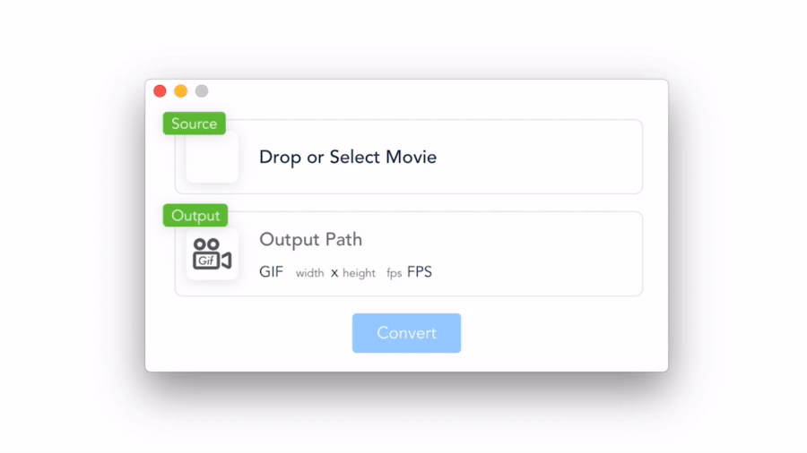

# Gifizer

Gifizer は動画をかんたんに GIF 化できるアプリケーションです。


## ダウロード (macOS, Windows)

https://github.com/kyushun/gifizer/releases/latest

## 開発環境

- Node.js (v12.x.x で動作確認済み)
- Yarn

## ビルド

1. モジュールのインストールを行います

```sh
yarn install
```

2. vue-cli (webpack) を使用してビルドします

```sh
yarn build
```
