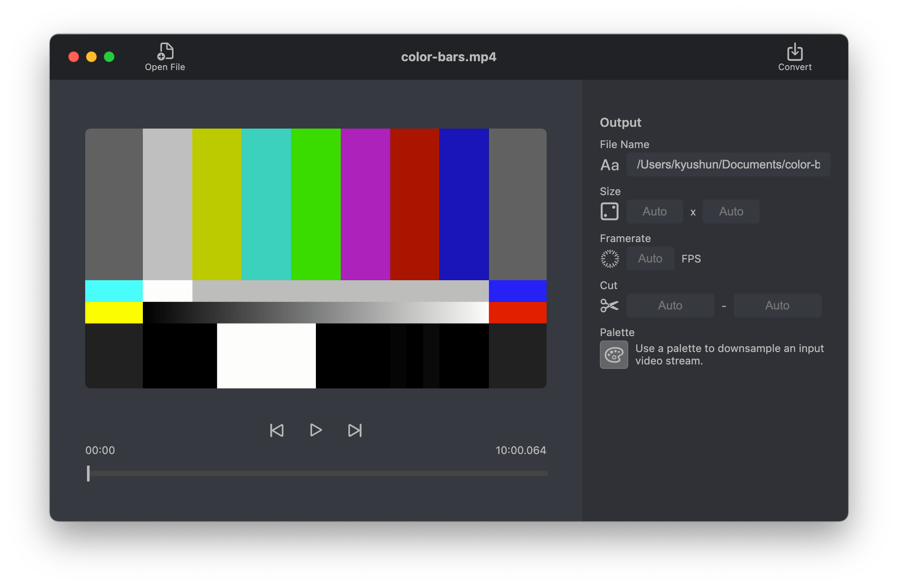

<div align="center">
  
  <p><strong>Simple and fast gif maker app.</strong></p>
  
</div>

## Download
For macOS and Windows users.

→ [**Gifizer App**](https://github.com/kyushun/gifizer/releases/latest)

## Development

### Requirements
- Node.js (14+ recommended)
- Yarn

### Run
```sh
yarn start
```

### Build
The app can be found in the `dist` folder.

```sh
yarn package
```
